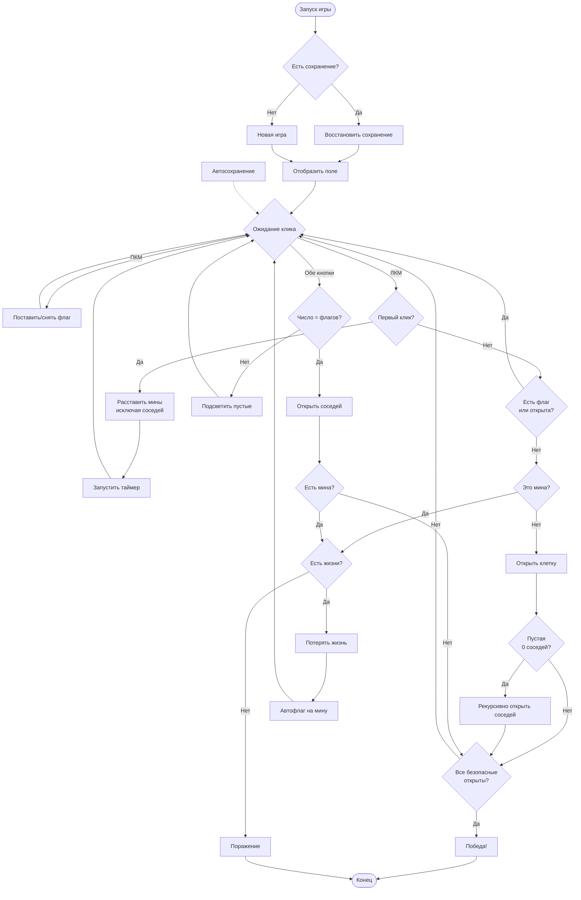
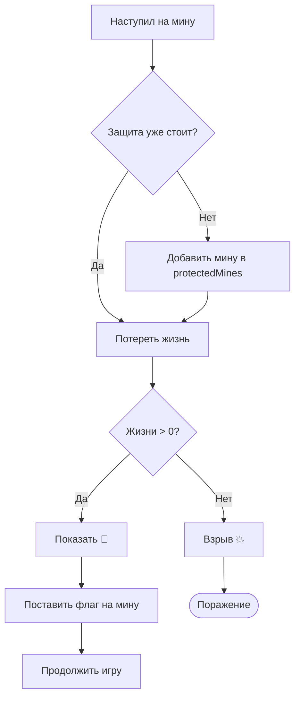
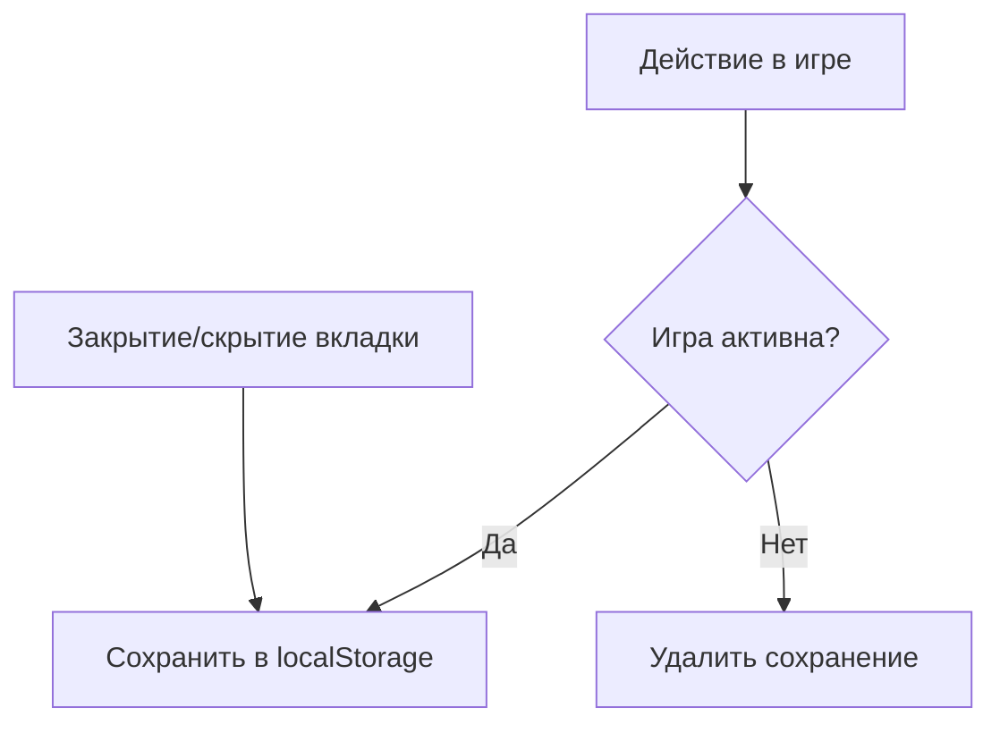

# Блок-схема логики игры "Сапёр"

## Основная схема

## Система жизней

## Автосохранение

## Расшифровка действий

| Действие | Описание |
|----------|----------|
| ЛКМ | Открыть клетку |
| ПКМ | Поставить/снять флаг |
| Обе кнопки | Открыть соседей (chord) |
| `protectedMines` | Мины, на которые игрок уже наступал (защита от повтора) |
